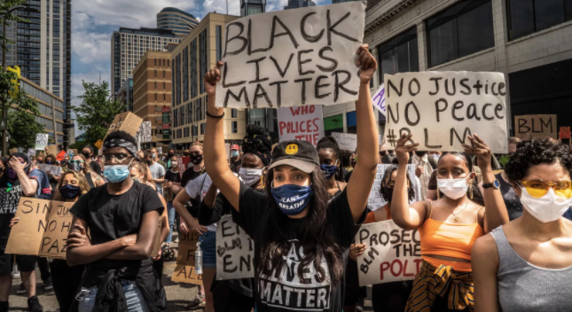

# Black Lives Matter Resources 
 A list of Black Lives Matter educational material. The BLM list of resources includes books, articles, videos, podcasts, and newsletters. 
 

## Books
 * [Stamped from the Beginning - The Definitive History of Racist Ideas in America](https://open.spotify.com/album/6PzcVM8Z1GMqeGlMBQ6ikX?si=HceQ3l1bT1G9jSW2EiNFGA) - This is a FREE audio book that does a great job going in depth about the historical racism in America.
 * [So You Want to Talk about Race](https://www.amazon.com/You-Want-Talk-About-Race/dp/1580058825/ref=sr_1_1?dchild=1&keywords=So+You+Want+to+Talk+about+Race&qid=1591297044&sr=8-1) - This book shares the truths about the realities of racism, power and oppression.
 * [The Colors of Us](https://www.amazon.com/Colors-Us-Karen-Katz/dp/0805071636) - This book is a positive message that celebrates the differences and similarities that connect all people.
 * [Waking Up White](https://www.amazon.com/Waking-White-Finding-Myself-Story/dp/B01EINQC3I) - This book explores race with the desire to understand the racial divide.
 * [Me and White Supremacy](https://www.meandwhitesupremacybook.com/) - This book is a good resource for examining and owning responsibility for the ways in which they uphold white supremacy.
 * [White Fragility](https://www.amazon.com/White-Fragility-People-About-Racism/dp/0807047414/) - A book that explores the counterproductive reactions white people have when their assumptions about race are challenged, and how these reactions maintain racial inequality.
 * [How To Be An Antiracist](https://www.ibramxkendi.com/how-to-be-an-antiracist-1) - This book covers Ibram X. Kendi's concept of antiracism reenergizes and reshapes the conversation about racial justice in America.
 * [Policing Black Lives](https://fernwoodpublishing.ca/book/policing-black-lives) - This book covers the state violence in Canada from slavery to the present.

## Videos
 * [13th](https://www.netflix.com/title/80091741) - This is an excellent documentary on Netflix that outlines the racism towards Black people in America.
 * [Explained: The Racial Wage Gap](https://www.netflix.com/title/80216752) - This short episode of Explained on Netflix does an excellent job explaining the racial wage gap in America.
 * [Who Killed Malcolm X?](https://www.netflix.com/title/80217478) - This documentary series on Netflix covers the historical events around the murder of Malcolm X.
 * [When They See Us](https://www.netflix.com/title/80200549) - This 4 part series on Netflix is the story of the Central Park 5.
 * [Talks to help you understand racism in America](https://www.ted.com/playlists/250/talks_to_help_you_understand_r) - This a good list of TED Talks that help educate about the racism in America.

## Podcasts
 * [1619 (NYTimes)](https://www.nytimes.com/2020/01/23/podcasts/1619-podcast.html) - This is a podcast series on how slavery has transformed America, connecting past and present through the oldest form of storytelling.
 * [Code Switch](https://www.npr.org/podcasts/510312/codeswitch) - This is a great podcast talking about various topics and conversations about race.
 * [Pod Save the People](https://crooked.com/podcast-series/pod-save-the-people/) - This podcast offers a unique take on the news, with a special focus on overlooked stories and topics that often impact people of color.
 * [Our National Conversation About Race](https://www.showaboutrace.com/) - This podcast is a lively multiracial, interracial conversation about the ways we can’t talk, don’t talk, would rather not talk about race.

## Articles
 * [The Death of George Floyd, In Context](https://www.newyorker.com/news/daily-comment/the-death-of-george-floyd-in-context) - This New Yorker article outlines the details around the incidents that sparked the Black Lives Matter movement in America after the death of George Floyd.
 * [How to Make This Moment the Turning Point for Real Change](https://medium.com/@BarackObama/how-to-make-this-moment-the-turning-point-for-real-change-9fa209806067) - This blog post by Barack Obama talks about how change can happen.
 * [For Our White Friends Desiring to Be Allies](https://sojo.net/articles/our-white-friends-desiring-be-allies) - This is a great article helping to educate people on how they can be strong allies.

## Newsletters
 * [Black Lives Matter Newsletter](https://blacklivesmatter.com/sign-up-for-updates/) - An email newsletter to get updates about the 2020 election cycle from Black Lives Matter.

## Contributing 
1. Fork it
2. Run `npm install`
3. Add your resource to `list.json`
4. Run `node index` to update `README.md` with your changes
5. Create your feature branch (`git checkout -b my-new-feature`)
6. Commit your changes (`git commit -am "Add some feature"`)
7. Push to the branch (`git push origin my-new-feature`)
8. Create new Pull Request
